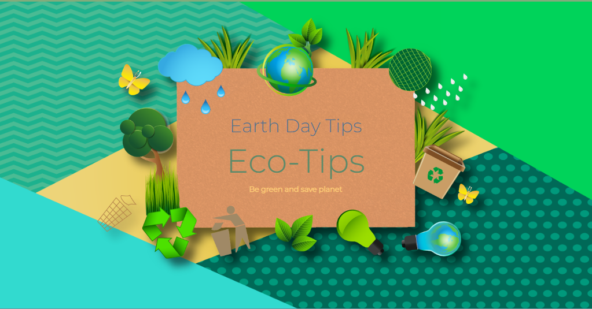
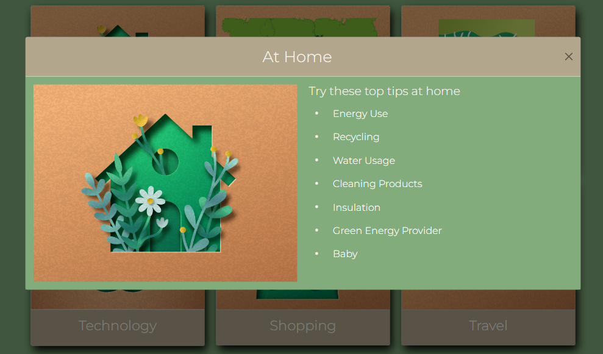

# Eco-Tips

## *The live site link can be found [Here](https://pbtrad.github.io/team-5/)*
### Table of contents

1. [Introduction](#Introduction)
1. [User Stories](#User-Stories)
1. [Design](#Design)
1. [Features](#Features)
1. [TESTING.md](project_files/TESTING.md)
1. [Bugs and Issues TESTING.md](project_files/TESTING.md#Bugs-and-Issues)
1. [W3C-Validation TESTING.md](project_files/TESTING.md#Validation)   
1. [Technologies and Frameworks](#Technologies-and-Frameworks)
1. [Deployment](#Deployment)
1. [Credits](#Credits)

## Introduction

### **Project**
Code Institute April 2020 Hackathon

### **Project Theme**
Earth Day 2022.

### **Project description**
A Hackathon is a 5-day sprint-like event in which teams collaborate intensively on software projects. The goal is to create a functioning project by the end of the event.

This website was designed to provide users with Earth Day tips. The main focus of the site is to create an online presence allowing users to find ways to celebrate Earth Day, things you can do for Earth Day, What can you do for Earth Day at home and relevant information.

The website is build using primarily HTML5, CSS3, JavaScript and Bootstrap.

### **Team: Green-Geeks**
 
Emily Asquith on [GitHub](https://github.com/ejasquith)\
Ivan M Ulysses on [GitHub](https://github.com/Sonicbasedrop)\
Kelven Hughes on [GitHub](https://github.com/KelvenH)\
Paul Browne on [GitHub](https://github.com/pbtrad)\
Peter Anny-Nzekwue on [GitHub](https://github.com/panzek)\
Raivis Petrovskis on [GitHub](https://github.com/Raivis80)\
Team Facilitator: Rachel Rock on [GitHub](https://github.com/rockymiss)

## User Stories

### **User goals**
- As a user, I want to be able to access site on various devices such us mobile, tablet or pc.
- As a user, I want to easily understand the main purpose of the site.
- As a user, I want to be able to easily navigate throughout the site to find desired content.
- I also want to locate their social media links.
- I want to get in contact with the site Administrator if any questions I may have.

### **Site owner goals**
- As a Site owner, I want to Provide potential users with Earth Day tips.
- As a Site owner, I want to Provide everyone who visits the site to have a good user experience.
- As a Site owner, I want to Provide user with easy site navigation.
- As a Site owner, I want to Build trust with customers - providing with social. media links.
- As a site owner, I want to provide user with contact options to Improve.customer satisfaction through better service.

## Strategy
### **The website needs to enable the User to**
- Able to understand the main purpose of the site.
- Navigate the site easily through categories clearly.
- Easy Navigate the site and find the relevant content.
- Find Website owner on their preferred social media platform.
- Contact Administrator if any issue or bug.

### **The website needs to**
- Provide user with simple user friendly interface.
- Provide a good site navigation to easy understand.
- Categorize content by its Subject types and relevance.
- Stay connected with users by providing social media links.
- To Provide user with contact options.

## Scope
### **Functionality Requirements**
- The website
    - Use of Bootstrap for responsive design
- Website Navigation with internal site links.
   - Internal lins is Linked in the website template pages 
   - Categorized navigation by its Subject types and relevance.
   - Responsive bootstrap website navigation
- Thumbnail Gallery view
    - On click to reveal individual item detailed view with Javascript or Bootstarp.
- Customer Support contact form.
   - Javascript API form control or similar
- Social Media links to external resources.

### **Content Requirements**
- NavBar
   - Internal site navigation Links with categories
   - Site brand name
   - Links to social media
- Landing Page
   - Full size Central Hero image
   - Tile and description text
- Categories pages
    - Image thumbnail linked to relevant detail modal
    - Tips title
    - Short description 
- Detailed view 
    - Tips Image
    - Tips title
    - Tips Description 
- Contact page
   - Contact Form
   - Links to Contributor Github pages
- footer
   - Copyright information
   - Social Links
     - FaceBook, LinkedIn, Instagram

## Skeleton
### **Wireframes**

- [Landing page wireframe](project_files/wireframes/landing-wf.png)
- [Categories page wireframe](project_files/wireframes/categories-wf.png)
- [Details page wireframe](project_files/wireframes/detailed-wf.png)

## Design
### **Color Scheme**
- Color scheme used through out the site.

beaver: #A88C7D
<div>
    <input type="color"value="#A88C7D">
</div>
khaki: #B2A68D
<div>
    <input type="color"value="#B2A68D">
</div>
light-orange: #FFCE7E
<div>
    <input type="color"value="#FFCE7E">
</div>
steel: #7297A0
<div>
    <input type="color"value="#7297A0">
</div>
dark-steel: #5C6D7A
<div>
    <input type="color"value="#5C6D7A">
</div>
queen-blue: #54738E
<div>
    <input type="color"value="#54738E">
</div>
dark-blue: #2F3A4A
<div>
    <input type="color"value="#2F3A4A">
</div>
asparagus: #82AC7C
<div>
    <input type="color"value="#82AC7C">
</div>
light-asparagus: #a3dc9c
<div>
    <input type="color"value="#a3dc9c">
</div>
dark-asparagus: #5c8a6c
<div>
    <input type="color"value="#5c8a6c">
</div>
off-white: #f7f5e
<div>
    <input type="color"value="#f7f5e">
</div>
black: #000000
<div>
    <input type="color"value="#000000">
</div>

### **Fonts**
- Body main text font family Montserrat As a backup sans-serif.
- Header-text font family Lato As a backup sans-serif.

### **Media**
All the images was supplied from adobe stock photos
## Features 
### **Existing Features**

- **Navigation**

    [Nav Bar image](project_files/features/nav.png)
    - Featured on all pages, the full responsive navigation bar includes links to the Logo, Home page and is identical in each page to allow for easy navigation.
    - Allow the user to easily navigate from page to page across all devices without having to revert back to the previous page via the ‘back’ button. 

- **Landing page** 

    
    - Large background image span the full width across the whole viewport and is responsive to all other browser sizes.
    - In the center outlined key earth day tips feature for users to easily understand the main purpose of the site.
    - Images was cut and crafted to match categories page style with Adobe Illustrator.
    - Keyframe based animation, with the geometry effects between keyframes and added smooth transition effects.

- **Categories page**

    
    - Responsive Image Grid that varies depending on screen size.
    - Click on image to reveal individual item detailed Modal.
    - Some of the Thumbnail images was created in Adobe illustrator to match rest of the images

- **Detailed Modal**

    
    - Description, Image that Provides information on a relevant Earth Day tips.
    - For detailed descriptions we are using bootstrap Modals
    - The modal is positioned over everything else in the document.
    - By clicking on the modal “backdrop” will automatically close the modal.

- **Contact Page**

    [Contact page image](project_files/features/contact.png)
    - Contact form allows users to communicate with the site owner
    - Contact page features Contributors names and contact info

- **Footer**

    [Footer image](project_files/features/footer.png)
    - Footer was designed to be responsive across all devices.
    - Footer features social media links and copyright information.

## **Technologies and Frameworks**

### **Languages Used**
-   [HTML5](https://en.wikipedia.org/wiki/HTML5) Hypertext Markup Language (HTML)
-   [CSS3](https://en.wikipedia.org/wiki/Cascading_Style_Sheets) Cascading Style Sheets (CSS)
-   [JavaScript](https://www.javascript.com/) Interactive functionality.

### **Frameworks, Libraries & Programs Used**
- [Bootstrap:](https://getbootstrap.com/docs/5.0/getting-started/download/) was used to assist with the responsiveness and to style the website.
- [Google Fonts:](https://fonts.google.com/) were used throughout the site.
- [Font Awesome:](https://fontawesome.com/) was used throughout the website to add icons.
- [jQuery:](https://jquery.com/) came with Bootstrap.
- [Git](https://git-scm.com/) Git was used for version control.
- [GitHub:](https://github.com/) used to store the projects code.
- [gitpod.io](https://gitpod.io/) gitpod Was used for codding.
- [Balsamiq:](https://balsamiq.com/) was used to create the wireframes.

## **Deployment**
### **Deploying on GitHub Pages**
1. Log into [GitHub](https://github.com/login "Link to GitHub login page") or [create an account](https://github.com/join "Link to GitHub create account page").
1. Locate the [GitHub Repository](https://github.com/pbtrad/team-5"Link to GitHub Repo").
1. At the top of the repository, select Settings from the menu items.
1. Scroll down the Settings page to the "GitHub Pages" section.
1. Under "Source" click the drop-down menu labelled "None" and select "Master Branch".
1. Upon selection, the page will automatically refresh meaning that the website is now deployed.
1. Scroll back down to the "GitHub Pages" section to retrieve the deployed link.
1. At the time of submitting this Milestone project the Development Branch and Master Branch are identical.

### **Forking the Repository**
1. Log into [GitHub](https://github.com/login "Link to GitHub login page") or [create an account](https://github.com/join "Link to GitHub create account page").
1. Locate the [GitHub Repository](https://github.com/pbtrad/team-5"Link to GitHub Repo").
1. At the top of the repository, on the right side of the page, select "Fork"
1. You should now have a copy of the original repository in your GitHub account.

### **Creating a Clone**
1. Install the [GitPod Browser](https://www.gitpod.io/docs/browser-extension/ "Link to Gitpod Browser extension download") Extension for Chrome.
1. After installation, restart the browser.
1. Log into [GitHub](https://github.com/login "Link to GitHub login page") or [create an account](https://github.com/join "Link to GitHub create account page").
1. Locate the [GitHub Repository](https://github.com/pbtrad/team-5"Link to GitHub Repo").
1. Click the green "GitPod" button in the top right corner of the repository.
This will trigger a new gitPod workspace to be created from the code in github where you can work locally.

**How to run this project within a local IDE, such as VSCode:**
1. Log into [GitHub](https://github.com/login "Link to GitHub login page") or [create an account](https://github.com/join "Link to GitHub create account page").
1. Locate the [GitHub Repository](https://github.com/pbtrad/team-5"Link to GitHub Repo").
1. Under the repository name, click "Clone or download".
1. In the Clone with HTTPs section, copy the clone URL for the repository.
1. In your local IDE open the terminal.
1. Change the current working directory to the location where you want the cloned directory to be made.
1. Type 'git clone', and then paste the URL you copied in Step 3.
```
git clone https://github.com/USERNAME/REPOSITORY
```
8. Press Enter. Your local clone will be created.

  Further reading and troubleshooting on cloning a repository from GitHub [here](https://docs.github.com/en/free-pro-team@latest/github/creating-cloning-and-archiving-repositories/cloning-a-repository "Link to GitHub troubleshooting") 

## Credits 

### **Code**
-  [stackoverflow.com](https://stackoverflow.com/): Useful website for code tips.

### Content 

- The icons in the footer were taken from [Font Awesome](https://fontawesome.com/)
